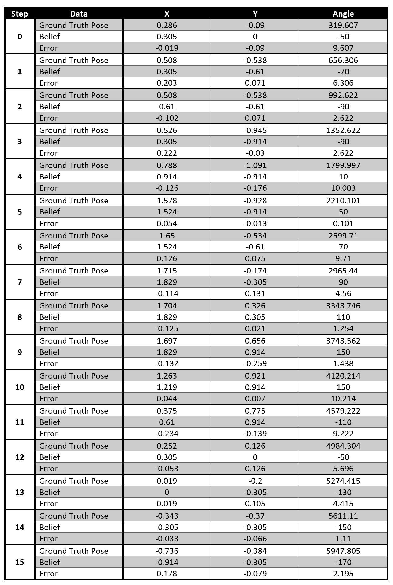

**Date: April 20, 2022**


### Compute Control
This function determines the translation and preceding and succeeding about-axis rotations that match the movement from a previous pose to the current pose. The change in x and y position where used to calculate the angle at which the overall motion occured. The two rotations were determined by finding the difference between the given initial and final angular orientations. The rotations were normalized to be inbetween -180 and 180 degrees. The translation was calculated as the distance between the (x,y) points. The right triangle relation and the previously calculated dx and dy were used to find the hypotenuse of the triangle which is the translation distance.

```
def compute_control(cur_pose, prev_pose):
    """ Given the current and previous odometry poses, this function extracts
    the control information based on the odometry motion model.

    Args:
        cur_pose  ([Pose]): Current Pose
        prev_pose ([Pose]): Previous Pose 

    Returns:
        [delta_rot_1]: Rotation 1  (degrees)
        [delta_trans]: Translation (meters)
        [delta_rot_2]: Rotation 2  (degrees)
    """
    dx = cur_pose[0] - prev_pose[0]
    dy = cur_pose[1] - prev_pose[1]
    ang = math.degrees( math.atan2(dy, dx) ) # atan2 return from -pi to pi --> convert to deg
    
    delta_rot_1 = mapper.normalize_angle(ang - prev_pose[2])
    delta_trans = math.hypot(dx, dy)
    delta_rot_2 = mapper.normalize_angle(prev_pose[2] - ang)
    
    return delta_rot_1, delta_trans, delta_rot_2
```

### Odometry Motion Model
This function determines the probability of a given pose in relation to the given control data and the previous pose data. The actual movement parameters are determined by passing both pose data to the compute_control function. For each element of the pose data a probability was computed. I calculated the probability based on the error to account for the wrap around for 0 to 360 degrees. I normalized the error (the difference between the two angles) and had a mean of zero for the guassian. Then the probability for each element is multiplied together to get the total probability.

```
def odom_motion_model(cur_pose, prev_pose, u):
    """ Odometry Motion Model

    Args:
        cur_pose  ([Pose]): Current Pose
        prev_pose ([Pose]): Previous Pose
        u (rot1, trans, rot2) (float, float, float): A tuple with control data in the format 
                                                   format (rot1, trans, rot2) with units (degrees, meters, degrees)


    Returns:
        prob [float]: Probability p(x'|x, u)
    """
    exp_u = compute_control(cur_pose, prev_pose)
        
    p_r1 = loc.gaussian(mapper.normalize_angle(exp_u[0]-u[0]), 0, loc.odom_rot_sigma)
    p_t = loc.gaussian(mapper.normalize_angle(exp_u[1]-u[1]), 0, loc.odom_trans_sigma)
    p_r2 = loc.gaussian(mapper.normalize_angle(exp_u[2]-u[2]), 0, loc.odom_rot_sigma)

    prob = p_r1*p_t*p_r2
    
    return prob
```

### Prediction Step
For all the possible states (each gird cell & angle), the prediction step goes through possible previous poses and determines the belief bar by updating the belief bar of that cell with information gathered from the pose, controls, and previous belief. This is the "predicting" of the prediction step. To speed up the filter, the possible state is only computed if the belief of the previous step was large enough. After going through all the iterations, the belief bar is normalized.

```
def prediction_step(cur_odom, prev_odom):
    """ Prediction step of the Bayes Filter.
    Update the probabilities in loc.bel_bar based on loc.bel from the previous time step and the odometry motion model.

    Args:
        cur_odom  ([Pose]): Current Pose
        prev_odom ([Pose]): Previous Pose
    """
    u = compute_control(cur_odom, prev_odom)
    
    for x_prev in range(mapper.MAX_CELLS_X):
        for y_prev in range(mapper.MAX_CELLS_Y):
            for a_prev in range(mapper.MAX_CELLS_A):
                
                if (loc.bel[x_prev,y_prev,a_prev] > 0.00001):
                    
                    for x in range(mapper.MAX_CELLS_X):
                        for y in range(mapper.MAX_CELLS_Y):
                            for a in range(mapper.MAX_CELLS_A):
                                cur_pose = mapper.from_map(x,y,a)
                                prev_pose = mapper.from_map(x_prev,y_prev,a_prev)
                                loc.bel_bar[x,y,a] = loc.bel_bar[x,y,a] + odom_motion_model(cur_pose, prev_pose, u) * loc.bel[x_prev,y_prev,a_prev]
                                
    loc.bel_bar = loc.bel_bar / np.sum(loc.bel_bar)
```

### Sensor Model
To make the code more general and easy to read, I implemented the sensor model. Before the sensor model function is called during the update step, the robot executes an observation loop. This data is stored in the variable obs_range_data. In the sensor model function, those measurements are compared to the observation measurements passed to the function. The observation measurements passed to the sensor model function correlate to a specific pose in the map and are computed using the mapper class function get_views().

```
def sensor_model(obs):
    """ This is the equivalent of p(z|x).


    Args:
        obs ([ndarray]): A 1D array consisting of the true observations for a specific robot pose in the map 

    Returns:
        [ndarray]: Returns a 1D array of size 18 (=loc.OBS_PER_CELL) with the likelihoods of each individual sensor measurement
    """
    prob_array = np.zeros((1, mapper.OBS_PER_CELL))
    
    measurements = loc.obs_range_data
        
    for i in range(mapper.OBS_PER_CELL):
        prob_array[0,i] = loc.gaussian(measurements[i], obs[i], loc.sensor_sigma)
                
    return prob_array
```

### Update Step
The update step loops through all of the possible poses and multiplies the sensor probability by the belief bar at that pose. The sensor probability is the product of the probabilities at each angle from the array returned by the sensor function. After going through all the iterations, the belief is normalized. The highest probability pose in the belief array is where the robot is most likely to be located.

```
def update_step():
    """ Update step of the Bayes Filter.
    Update the probabilities in loc.bel based on loc.bel_bar and the sensor model.
    """ 
    for x in range(mapper.MAX_CELLS_X):
        for y in range(mapper.MAX_CELLS_Y):
            for a in range(mapper.MAX_CELLS_A):
                sense_prob = np.prod( sensor_model(mapper.get_views(x,y,a)) ) 
                loc.bel[x,y,a] = sense_prob*loc.bel_bar[x,y,a]
                
    loc.bel = loc.bel / np.sum(loc.bel)
```    

### Running the Bayes Filter
A predetermined trajectory that avoids obstacles was used to test the Bayes Filter.

```
for t in range(0, traj.total_time_steps):
    print("\n\n-----------------", t, "-----------------")
    
    prev_odom, current_odom, prev_gt, current_gt = traj.execute_time_step(t)
        
    # Prediction Step
    prediction_step(current_odom, prev_odom)
    loc.print_prediction_stats(plot_data=True)
    
    # Get Observation Data by executing a 360 degree rotation motion
    loc.get_observation_data()
    
    # Update Step
    update_step()
    loc.print_update_stats(plot_data=True)
```

### The Bayes Filter in Action
I sped up the video by 4 times so you don't have to watch a 2 minute video.




### The Data
The angular orientation of the robot is continually increased, because at each step it performs the 360 degree observation loop and potentially more based on the trajectory controls. The orientation isn't normalized to 0 to 360 degrees, so I did that during my data analysis. The error for each state (x,y,theta) actaully remains small at each step, so I knew my Bayes Filter was working well.



  
