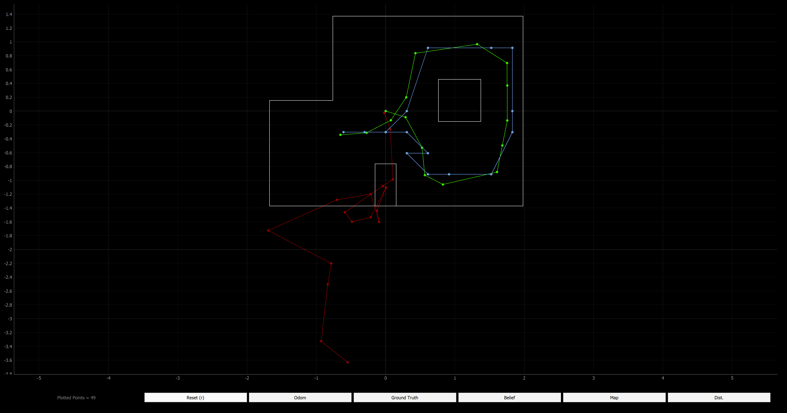
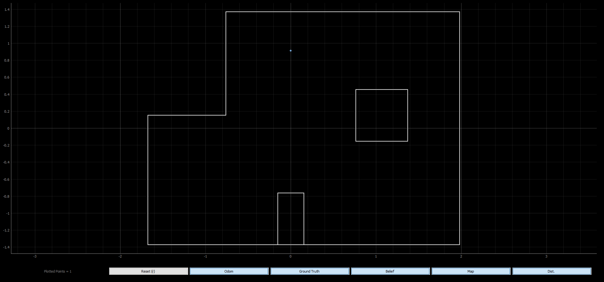

**Date: May, 2022**


### Localization Test in Simulation
Before implementing on the real robot, I verified the Bayes Filter simulation worked again. The green path is the truth pose, the blue path is the localization, and the red path is the odometry which is just as bad as always. HOwever, as you can see, the belief of the localization is very similar to the truth pose.





### Implementing the perform_observation_loop function of the RealRobot class
The perform observation loop function does a 360 degree turn with the real robot similar to what was done in the simulator.  The robot collects 18 sensor readings as defined in the observation count variable in the world.yaml file. Therefore, I start by creating two numpy column arrays with 18 elements. The next three variables are used to handle and process the data from the Artemis. Then I send the command to actaully take the measurements. I reused the code from Lab 9, the mapping lab. Becuase I want 18 measurement and 360/18 = 20, I know I need to increase the angle by 20 degrees after each measurement. I pass 20 with the map command, so the Artemis knows to increase the yaw/angle setpoint by 20 degrees each time. 

In the previous labs, I was never able to reliably get notification handlers to work due to issues with Windows 11 and using a VM. However, I was able to develop a very reliable method for my purposes. On Artemis, after the robot executes all the commands while collecting the data into arrays, I loop through the arrays and package all the corresponding data to be sent as a string. Between each loop I have a delay to allow time for the information to be sent over bluetooth. After all the collected data is sent, I send a string that says "done". On the python side, as you can see, I have a while loop the constantly receives the data from the Artemis and appends it to an array with all the data. When it gets the "done" string, the while loop is exited. Then I can process the data however I need to. This method has worked well for me in past labs and in this lab. 

I get rid of the "done" string from my data array, becuase I don't want to return that to the rest of the localization algorithm. Sometimes because of the method I use to transmit the data, duplicates of the data are received, so first of the three for loops determines how many instances there are of repeated data. The next for loop actually gets rid of the repeated data while taking into account the changing size of the array so I don't get any index out of bound errors. The last for loop splits the Anglur position data and the distance measurement data which I separated on the Artemis side with a comma. Then the data is appropriately converted and added to the two array which are returned by the function.


```
def perform_observation_loop(self, rot_vel=120):
    """
    Perform the observation loop behavior on the real robot, where the robot does  
    a 360 degree turn in place while collecting equidistant (in the angular space) sensor
    readings, with the first sensor reading taken at the robot's current heading. 
    The number of sensor readings depends on "observations_count"(=18) defined in world.yaml.

    Keyword arguments:
        rot_vel -- (Optional) Angular Velocity for loop (degrees/second)
                    Do not remove this parameter from the function definition, even if you don't use it.
    Returns:
        sensor_ranges   -- A column numpy array of the range values (meters)
        sensor_bearings -- A column numpy array of the bearings at which the sensor readings were taken (degrees)
                           The bearing values are not used in the Localization module, so you may return a empty numpy array
    """

    sensor_ranges = np.zeros((18,1))
    sensor_bearings = np.zeros((18,1))

    count = 0

    data = []
    s = " "

    ble.send_command(CMD.MAP, "20") # |increment on set pt (deg) |

    while not (s == "done"):
        s = ble.receive_string(ble.uuid['RX_STRING'])
        data.append(s)    

    print(data)
    del data[-1]

    # Find how many duplicate measurements there are in the received data
    for i in range(0, len(data)-1):
        if data[i] == data[i+1]:
            count=count+1

    # Get rid of duplicate data
    for j in range(0, len(data)-1-count):
        if data[j] == data[j+1]:        
            del data[j]

    # Split the Yaw data from the ToF data, convert ToF units
    for k in range(0,18):
        vals = data[k].split(",")
        sensor_ranges[k] = float(vals[1])/1000
        sensor_bearings[k] = float(vals[0])

    return sensor_ranges, sensor_bearings
```


### Results
I think my motors are degrading, and the left motor is degrading faster than the right motor, probably due to build up of particles on the motor and in the components. The left side wheel did not move at exactly the same rate as the right side wheel, so I increase the previously successful calibration factor. I also increased the base turning speed and then the mapping worked much better. It still wasn't a perfectly smooth and symmetrical turn, but it worked adequately well for localizing.
    
I placed the robot on each of the four marked poses. After running the update step of the Bayes Filter using the sensor measurement data to localize with a uniform prior on the pose, these are the results.

#### (-3 ft, -2 ft) // (-0.914 m, 0.610 m)
Update Step Time: 0.005 secs

Belief: (-0.914, -0.610, 170.000)

In this location I was able to correctly localize the x and y position on the first attempt. I started my robot facing the wall, so in reality my robot had an angular orientation of 180 degrees. The belief was that the angular orientation was 170 degrees. The angle is a bit off, but this is a reasonalbe amount of error. This location has some unique features, so localizing here is easier.


#### (0 ft, 3 ft) // (0 m, 0.914 m)
Update Step Time: 0.006 secs

Belief: (0.000, 0.914, 150,000)

Again, I started my robot facing the wall with an angular orientation of 180 degrees and was able to correctly localize the x and y position. This location is less unique, so it was harder to get a good belief and thus this probably caused more error in the angular orientation belief.



#### (5 ft, -3 ft) // (1.524 m, -0.914 m)
Update Step Time: 0.011 secs

Belief: (-1.219, 0.000, -30.000)

This location was extremely hard for me to localize. I consistently got a belief of (-4 ft, 0 ft) which is incorrect. I can see how these to spots would have similar measurements at different orientations because of the features of the map. I tried starting at different orientations (0, 180, etc.) at (5 ft, -3 ft), but I continued to get a belief of (-4 ft, 0 ft). I wanted to do a test is a similar location to see if the issue persisted.


Update Step Time: 0.015 secs

Belief: (1.219, -0.914, -10.000)

I moved the robot to the left one square to it was starting at (4 ft, -3 ft) facing the wall (angular orientation of 0 degrees. The robot had to trouble localizing in the spot. This spot is more unique with the configuration of the obstacles, so it was able to localize better in the pose. As seen before, there is small but reasonable error in the angular orientation.


#### (5 ft, 3 ft) // (1.524 m, 0.914 m)
Update Step Time: 0.004 secs

Belief: (1.524, 0.914, -10.000)

I started my robot facing the wall with, but that meant this time, the angular orientation was 0 degrees. Again, my x and y belief matched the actual position and there was a small but reasonable error in the angular orientation belief. This was a similar difficulty to (0 ft, 3 ft) for the same reasons. This corner is not super unique.


