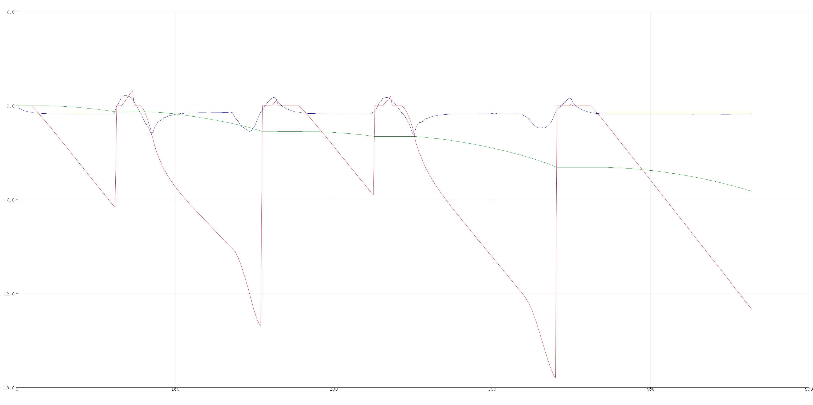

**Date: May, 2022**

So far in this class, I have implemented PID feedback control, mapping, and localization algorithms. The goal of this lab is to use whatever bits and pieces of knowledge and the skills learned in this class to get the real robot to visit 9 waypoints. 

### First Attempt: Dead Reckoning 
Towards the beginning of this class we talked about dead reckoning in lecture. Dead reckoning is the process of estimating your current position by using a previous position and incorporating velocity and/or angular orientation data over time. Therefore, the IMU sensor is potentially a good tool to perform dead reckoning. I wanted to try to use dead reckoning with the accelerometer even though in class we talked about its drawbacks, because we hadn't implemented it in class yet. Dead reckoning is extremely suseptible to accumulation errors especially with a noisy sensor like the accelerometer. I definitely saw this issue pop up and this ultimately was the reason I decided to move onto a new method for executing the path.

My original idea was to use PID feedback control on the orientation for making turns and ensuring I was driving in a straight line (not drifting). Since the robot would be moving in a straight line, I thought doing dead reckoning would have less accuracy issues than doing dead reckoning along a curved path.

The following are parts of the code I wrote to compute the dead reckoning. I essentailly integrate the acceleration to get the velocity and then integrate the velocity to get the position. I also implemented a low pass filter on the acceleration.

```
double acc_LPF[] = {0, 0};
double vel[] = {0, 0};
double pos[] = {0, 0};
const int n = 1;


dt = (micros() - prev_t) / 1000000.0;
prev_t = micros();


acc = (myICM.accX() / 1000 * 9.807); //convert units from mg > g > m/s^2

// Low Pass Filter Accelertation
const float a = 0.15;
acc_LPF[n] = a * acc + (1 - a) * acc_LPF[n - 1];

// Velocity
vel[n] = vel[n - 1] + acc_LPF[n - 1] * dt;

// Distance/Position
pos[n] = pos[n - 1] + vel[n - 1] * dt;

// Update
acc_LPF[n - 1] = acc_LPF[n];
vel[n - 1] = vel[n];
pos[n - 1] = pos[n];
```

The blue curve is **acceleration**, the red curve is **velocity**, and the greed curve is **position**. The velocity and position curves are in units of cm/s and cm for ease of visualization.


I pushed the robot forward once, pulled the robot backwards once, and then pushed the robot forward again. You can see the 3 bumps in the velocity data and the corresponding changes in the acceleration data.

I set up the sensor's built-in digital low pass filter to see if that would improve the data. I messed abournd with some of the settings and saw some improvemnts in the acceleration data but nothing too significant. The acceleration curves look smoother, but the velocity curve (and postion curve) are still accumulating a lot of error.

```
ICM_20948_dlpcfg_t myDLPcfg;    // Configuration structure for the desired sensors (accel & gyro)

myDLPcfg.a = acc_d111bw4_n136bw; // (ICM_20948_ACCEL_CONFIG_DLPCFG_e)
myDLPcfg.g = gyr_d361bw4_n376bw5; // (ICM_20948_GYRO_CONFIG_1_DLPCFG_e)

myICM.setDLPFcfg((ICM_20948_Internal_Acc | ICM_20948_Internal_Gyr), myDLPcfg);

// Choose whether or not to use DLPF
ICM_20948_Status_e accDLPEnableStat = myICM.enableDLPF(ICM_20948_Internal_Acc, true);
ICM_20948_Status_e gyrDLPEnableStat = myICM.enableDLPF(ICM_20948_Internal_Gyr, true);
```


Another fix I tried was to just get rid of the steadily increasing part of the velocity curve. You can see the bumps in the previous two graph were I move the robot, so it did have some non-zero velocity. I estimated the slope of the non-peaked portions of the graph. Then if the change in velocity was less than or equivalent to the slope I set the velocity equal to zero.

```
if ( abs(vel[n] - vel[n - 1]) <= 0.001) {
  vel[n] = 0;
}
```
This didn't end up working as intended. When the acceleration starts to decrease, so the peak of the velocity bumps, the velocity is small enough to be in the range of the slope. This causes weird behaviors.




Ultimately, I could not overcome the sensor noise and error accumulation. I probably shouldn't have spent so much time trying to get this to work, but I was really interested in the implementation. I think with a better IMU sensor and accelerations that were larger and not so breif, it could be possible to effectively implement dead reckoning as a reasonble means to determine position in this type of situation.


### Second Attempt: Feedback Control with PID & Orientation Control
My PID controller worked super well in previous labs. It was generally reliable and fast, especially the angular orientation control. See Lab 6 for more details on tuning the PID controller for orientation control. However, the sampling rate of the ToF data was too slow when also doing PID contorl on the angular orientation in the loop, so I wasn't able to get ToF data frequently enough to stop at an accurate position. I wanted to do angular orientation control so the robot would travel in a straight line. 

### Third Attempt: Feedback Control with just PID
In previous labs my system functioned fine moving in a straight line by just multiplying the left wheel speed by a calibration factor. To speed up the loop execution speed I eliminated the PID control on angular orientation and only did position control with respect to the ToF data. With this method I was able to stop more accurately and was able to travel distances I specified.

### Path Plan
I wrote a python script to calculate all the distances and angles between the waypoints. It also converted the units appropriatly so I could pass parameters to the Artemis via bluetooth and not have to waste time converting units onbaord. I decided to start with the robot oriented at 0 degrees. Then the robot will turn so its facing backwards and drive in reverse towards the first waypoint becuase the walls in the corner are closer and this method is more reliable.


I translated this path plan into a series of commands for the robots to follow. The code also includes the initialization of the objects need for the plotter and localiztion. I had to put in time.sleep() delays in the python script to match the timing in the Artemis code. To figure out the the necessary time delays I performed a test on the spin rate of the robot, given by the gyroscope data is degrees per second (DPS).  I did the test on the maximum angle the robot would have to turn in the map which is 135 degrees, because

Therefore, I alloted 2 seconds for turns and 5 seconds for the dribing portions.

```
# Initialize RealRobot with a Commander object to communicate with the plotter process
# and the ArtemisBLEController object to communicate with the real robot
robot = RealRobot(cmdr, ble)
# Initialize mapper
# Requires a VirtualRobot object as a parameter
mapper = Mapper(robot)

# Initialize your BaseLocalization object
# Requires a RealRobot object and a Mapper object as parameters
loc = Localization(robot, mapper)

## Plot Map
cmdr.plot_map()
# Reset Plots
cmdr.reset_plotter()

# Init Uniform Belief
loc.init_grid_beliefs()

--- VISIT WAYPOINTS ---

# pt1 --> pt3
ble.send_command(CMD.TURN, "2.5|0.3|0.3|-135")
time.sleep(2)
ble.send_command(CMD.REVERSE, "45|862.1")
time.sleep(5)
ble.send_command(CMD.TURN, "2.5|0.3|0.3|135")
time.sleep(2)
ble.send_command(CMD.DRIVE, "45|914.4")
time.sleep(5)

# pt3 --> pt5
ble.send_command(CMD.TURN, "2.5|0.3|0.3|-63.43")
time.sleep(2)
ble.send_command(CMD.DRIVE, "45|681.6")
time.sleep(5)
ble.send_command(CMD.TURN, "2.5|0.3|0.3|63.43")
time.sleep(2)
ble.send_command(CMD.DRIVE, "45|914.4")
time.sleep(5)

# pt5 --> pt7
ble.send_command(CMD.TURN, "2.5|0.3|0.3|90")
time.sleep(2)
ble.send_command(CMD.DRIVE, "45|1828.8") # Combine these two segments for time/speed
time.sleep(5)

# pt7 --> pt8
ble.send_command(CMD.TURN, "2.5|0.3|0.3|90")
time.sleep(2)
ble.send_command(CMD.DRIVE, "45|1524")
time.sleep(5)
 
# pt8 --> pt9
ble.send_command(CMD.TURN, "2.5|0.3|0.3|90")
time.sleep(2)
ble.send_command(CMD.DRIVE, "45|914.4")
time.sleep(5)
-----------------------

# Get Observation Data by executing a 360 degree rotation motion
loc.get_observation_data()

# Run Update Step
loc.update_step()
loc.plot_update_step_data(plot_data=True)
```

### The Run
*video*

*discussion of performance*

### Localization
I was able to get the locaization to work well in Lab 12, so I wanted to focus more on executing the navigation in this lab. It would be very simply to implement localization at every waypoint by just calling the same functions I wrote as in Lab 12. That localization data could then be used to inform the controls to adjust the robot's position. I did perfrom Localization at the last waypoint (0,0) to check that I ended up in the correct place. 

Update Step Time: 0.023 secs

Belief: (0.000, 0.000, -90.000)

The x, y, and theta belief of (0 ft, 0 ft, -90.000) was correct! I took this localization data from the more precise, second half of the run. In that instance, robot was mostly in (0,0) tile and was facing downward in the map which would be 270 degrees or -90 degrees.


### Discussion
Please carefully document how well your solution, and all parts of it, works. This may include a brief introduction to the capabilities of your system, relevant code snippets, and a flowchart diagram of what processes (offboard/onboard) run when; how long each take to execute and how reliable/accurate the outcome is.

Note that these waypoints are increasingly difficult, and you may not be able to execute the full length of waypoints or hit all of them accurately. Quantify and discuss how well your solution works (and why it works better in some situations). And of course, upload a video of your best run; please be sure to include both planning and execution steps (e.g. by combining screen capture and live video of the robot).


