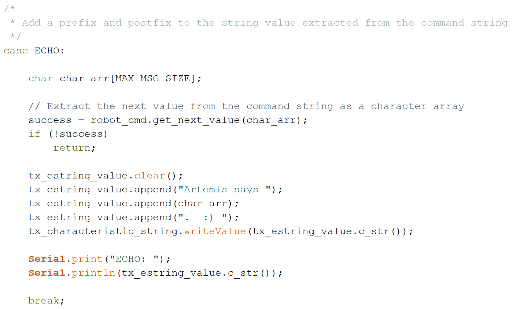

**Date: February 2nd, 2022**

# Objectives
1. Establish a connection between a computer and the Artemis Nano using a Bluetooth Low Energy (BLE) adapter
2. Become familar with Jupyter notebook and Python

# Components
- 1 x SparkFun RedBoard Artemis Nano
- 1 x USB-C to USB-C cable
- 1 x Bluetooth USB Adapter

# Procedure
*I have Windows 11 on my laptop, so I faced many issues connecting to the Artemis Nano via Bluetooth through Jupyter notebooks. I ended up using the computers in the lab to complete the tasks.*

- Installed Python 3.10.2 and pip 22.0.2
    - Then installed virtualenv, a module to create isolated Python environments, and created a new virtual environment ece4960_ble in the project directory I would be using for this lab
- Installed the following packages: numpy, pyyaml, colorama, nest_asyncio, bleak, jupyterlab
- Downloaded the codebase containing ble_arduino and ble_python into my project directory
- Activated the ece4960_ble virtual environemnt and started the Jupyter server
- Installed the ArduinoBLE library through the Arduino IDE and uploaded ble_arduino to the Artemis Nano
    - The Artemis Nano printed its MAC address in the serail monitor
- Executed all the tasks in the demo notebook in JupyterLab
    - Updated the MAC address of the Artemis Nano in the configuration.yaml file
    - Checked the UUIDs in the Arduino sketch and Python configuration matched
    - Sent a PING command to which the Artemis sent back PONG
    - Sent 2 integers which the Artemis returned
 
 
 
 
 
 ### Task 1
 - I wrote the ECHO command in the ble_arduino sketch



### Task 2
- I wrote the SEND_THREE_FLOATS command in the ble_arduino sketch


I used the following python code to send commands from the computer to the Artemis Nano for Tasks 1 & 2:

```
ble.send_command(CMD.ECHO, "What's Up")
ble.send_command(CMD.SEND_THREE_FLOATS, "-1.23|45.67|8.9")
```


### Task 3
- I wrote the following python code for the notification handler, a callback function which is called on notification, that updates the global variable when the specified characteristic changes. Its input parameters are a UUID and byte array. The byte array is converted to a float and assigned to the global variable.

```
ble_float = 0.0
def notif_handler(uuid, ble_byte_array):
    global ble_float
    ble_float = ble.bytearray_to_float(ble_byte_array)

ble.start_notify(ble.uuid['RX_FLOAT'], notif_handler)

import asyncio
while True:
    print(ble_float)
    await asyncio.sleep(1)
```
The start_notify function activates notifications to be sent when the characteristic specified by the UUID is updated, so constantly having to check for updates is unnecessary. The while loop prints the global variable then waits for 1 second.



### Task 4
Maintaining the float data type is more efficient for a small amount of data, becuase it takes fewer bits to send a float than a string of the same length. However, if there's a lot of data, it's more efficient to put all the data together in a string. It's simpler to receive one string and reduces the memory cost of individually telling the computer the type of each piece of data. A downside is having to parse out the float values from the string, and you need to be careful not to exceed byte limits.
