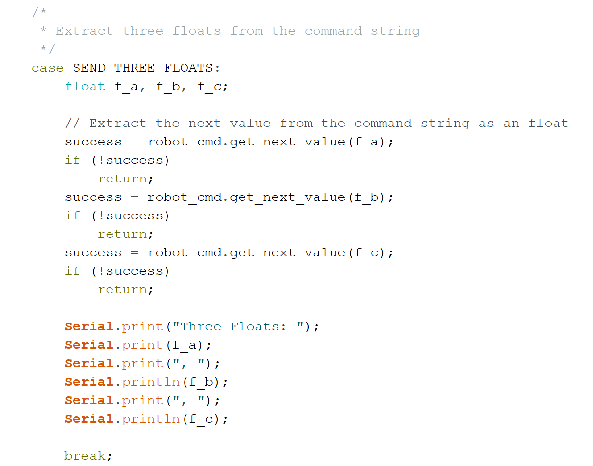

**Date: February 2nd, 2022**

# Objectives
1. Establish a connection between a computer and the Artemis Nano using a Bluetooth Low Energy (BLE) adapter
2. Become with familar with Jupyter notebook and Python

# Components
- 1 x SparkFun RedBoard Artemis Nano
- 1 x USB-C to USB-C cable
- 1 x Bluetooth USB Adapter

# Procedure
*I have Windows 11 on my laptop, so I faced many issues connecting to the Artemis Nano via Bluetooth through Jupyter notebooks. I ended up using the computers in the lab to complete the tasks.*
- I installed Python 3.10.2 and pip 22.0.2
    - Then installed virtualenv, a module to create isolated Python environments, and created a new virtual environmetn ece4960_ble
- Installed the following packages: numpy, pyyaml, colorama, nest_asyncio, bleak, jupyterlab
- Downloaded the codebase containing ble_arduino and ble_python into the my project directory on my computer
- Activated the ece4960_ble virtual environemnt and started the Jupyter server
- Installed the ArduinoBLE library in the Arduino IDE and uploaded ble_arduino to the Artemis Nano
    - The Artemis Nano printed its MAC address in the serail monitor
- Executed all the tasks in the demo notebook in JupyterLab
    - Updated the MAC address of the Artemis Nano in the configuration.yaml file
    - Checked the UUIDs in the Arduino sketch and Python configuration matched
 
 ### Task 1
 - I wrote the ECHO command

### Task 2
- I wrote the SEND_THREE_FLOATS command

I used the following python code to send the commands from the computer to the Artemis Nano for Tasks 1 & 2:

()

### Task 3
- I wrote the following python code to ...
()
embedded video

### Task 4
