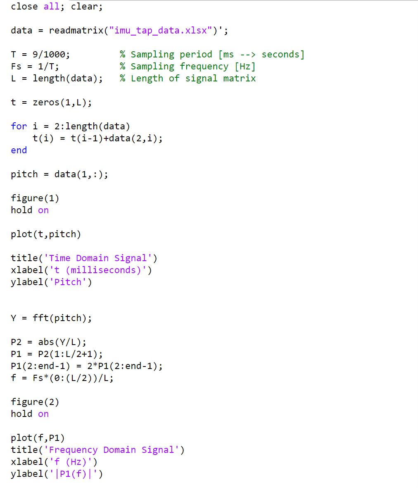
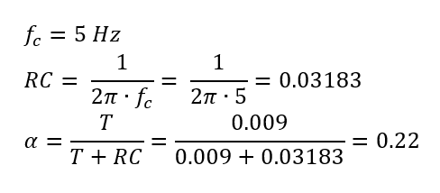

**Date: February 9nd, 2022**

# Objectives
1. Figure out the wiring between the TOF sensors, IMU, and Artemis Nano and solder the connections
2. Get the sensors functioning/Test the sensors

# Components
- 1 x SparkFun RedBoard Artemis Nano
- 1 x USB-C to USB-C cable
- 2 x VL53L1X Time of Flight sensors
- 1 x ICM-20948 Inertial Measurement Unit sensor
- Stranded wires
- Soldering iron + solder

# Procedure
- I installed the SparkFun VL53L1X Time of Flight Sensor library & the SparkFun 9DOF IMU Breakout ICM 20948 Arduino Library in the Arduino IDE.
- Thinking about the sensor positioning on the RC car, I did all the soldering first.


- I used the QWIIC-to-cable connecter from the Artemis Nano to the IMU
- Then I daisy chained the first TOF sensor to the IMU
- Finally, I daisy chained the first TOF to the second TOF
    - The second TOF has the XSHUT pit connect to the Artemis nano pin A3.
        


- I uploaded File->Examples->Apollo3->Example05_Wire_I2C
    - VL53L1X I2C device address: 0x52 = 82 in decimal = 0b1010010 in binary
    - ICM-20948 I2C address: AD0 = 0 -> 0x68 = 104 in decimal = 0b1101000 in binary
        - AD0_VAL is 1 by default unless the ADR jumper is connected. Connecting the I2C ADR jumper changes the default address of the IMU and AD0_VAL becomes 0. In this case the internal jumper is connected, so AD0_VAL should be 0.
        - Becuase I connected the IMU first, I was able to properly detect its address before I connected the 2 TOF sensors



I ran into the issue with printing the addresses when all the sensors are connected.


- I used .setDistanceModeShort(), the short distance mode
    - Short distance mode is less affected by the ambient light conditions, but its maximum ranging distance is
more limited

### VL53L1X TOF Sensor

### Testing Setup


You can see the TOF senor is half a foot from the black and red box, and in the background the Serial Monitor is printing the distance is 0.50 ft.

- I uploaded File->Examples->SparkFun VL53L1X 4m Laser Distance Sensor->Example1_ReadDistance
    - I changed the sketch to also get the ranging time and the presecribed inter-measurement period
    - I removed the vacuum tape from the sensor before taking any measurements
    - The TOF was set at the end of the tape measure, and I moved the black and red box towards and away from the sensor in 1 inch increments
    - 3 trials were performed

### Range, accuracy, repeatability


- The sensor has good repeatability even in the short distance mode (where the timing budget can be decreased more than in the other modes)
- The data is linear between 0.5 feet and 2 feet which means the expected and actual measurements match very well. In this section the measurements are accurate.
- The x-offset of the graph shows the minimum discernable distance in practice is around an inch
- I found the maximum distance measurable in short distance mode to be 7.71 ft (2.35 m) when the actual distance was 8 ft. After going past 8ft, the measured distance registered as 0.00 ft. However, the TOF sensor is not accurate at this distance.

### Ranging time
- I used the .getIntermeasurementPeriod() method
  - The specified inter-measurement period (in milliseconds) determines how frequently the sensor takes a measurement
  - If it's shorter than the timing budget, the sensor will start a new measurement as soon as the previous one finishes
- According to the datasheet, the default timing budget is 100 ms
  - It's possible to decrease it to 20 ms only in short distance mode, but this affects repeatability
  - Increasing the timing budget increases the maximum range the device can measure and improves the repeatability error, but the power consumption increases as well
- I also manually calculated the elapsed time using millis() and taking the difference of the time just after ranging starts and just after ranging stops



As I take measurements at different distances, the calculated time and period remain constant

### Different colors and textures
I used my hand which has an irregular shape, a lamp to change the amount of ambient light, and a bright green notebook which has a different surface texture and color to test the TOF sensor. I didn’t see any significant changes to the results.

### ICM 20948 IMU Sensor
- I uploaded File -> Examples -> SparkFun 9DoF IMU Breakout – ICM 20948 – Arduino Library -> Arduino -> Example1_Basics


- Next, I changed the sketch to only output the data I needed for each test
  - I also looked at the difference between the raw IMU data vs the scaled IMU data.

### Raw IMU Data


### Scaled IMU Data


- The scaled data looks less noisy

This video shows the x, y, and z components from the accelerometer and gyroscope.


The accleration ouputs are in units of milli-g's. That is why the y acceleration (the green line) is offset from zero by 1000. You can see the 6 different line plots responsd appropriately to the movement of the sensor.


The accelerometer is pretty accurate. Both the pitch and roll changed by -90 and +90 degrees according to the tilting of the sensor.

### Frequency Response



I saved the data from the Serial Monitor and used the following MATLAB script to plot the time and frequency domains.



I was tapping at about 240 beats per minute (bpm) which is equivalent to about 4 Hz. Around 4 Hz there is a peak with an amplitude of 8. The sensor seems to be pretty noisy. I performed the following calculation to determine the Low Pass Filter parameters.



I used this alpha in my code to find the pitch. Increasing f_c, the cutoff frequency, increases RC which in turn increases the value of alpha and makes a more aggressive low pass filter.

### Implementation of the Low Pass Filter



The low pass filter smooths out the data by removing some of the noise. I don't see significant lag with my filter. It follows the accelerometer pitch well.

Here are two close up images to clearly see how the low pass filter is changing the output:


There is less jaggedness due to noise and less response to big jumps.

### Gyroscope


The output values are all comparable. The pitches all follow each other. The same goes for the rolls. The values for yaw are reasonable as well.




# Code
This is my code for the TOF tests:
```
#include <ComponentObject.h>
#include <RangeSensor.h>
#include <SparkFun_VL53L1X.h>
#include <vl53l1x_class.h>
#include <vl53l1_error_codes.h>
#include <Wire.h>
#include "SparkFun_VL53L1X.h" //Click here to get the library: http://librarymanager/All#SparkFun_VL53L1X

#define SHUTDOWN_PIN A3

SFEVL53L1X distanceSensor;

//Uncomment the following line to use the optional shutdown and interrupt pins.
SFEVL53L1X distanceSensor2(Wire, SHUTDOWN_PIN);

//global variables available anywhere in the program
unsigned long startMillis;
unsigned long currentMillis;
unsigned long diff;

void setup(void)
{
  Wire.begin();

  Serial.begin(115200);
  Serial.println("VL53L1X Qwiic Test");

  if (distanceSensor.begin() != 0) //Begin returns 0 on a good init
  {
    Serial.println("Sensor failed to begin. Please check wiring. Freezing...");
    while (1)
      ;
  }
  Serial.println("Sensor online!");

  pinMode(SHUTDOWN_PIN, OUTPUT);
  digitalWrite(SHUTDOWN_PIN, LOW);

  distanceSensor.setDistanceModeShort();
}

void loop(void)
{
  distanceSensor.startRanging(); //Write configuration bytes to initiate measurement
  startMillis = millis();
  while (!distanceSensor.checkForDataReady())
  {
    delay(1);
  }
  int distance = distanceSensor.getDistance(); //Get the result of the measurement from the sensor
  distanceSensor.clearInterrupt();
  distanceSensor.stopRanging();
  currentMillis = millis();
  diff = currentMillis-startMillis;

  Serial.print("Distance(mm): ");
  Serial.print(distance);

  float distanceInches = distance * 0.0393701;
  float distanceFeet = distanceInches / 12.0;

  Serial.print("\tDistance(ft): ");
  Serial.print(distanceFeet, 2);

  //Serial.print("\tRanging Time(ms): ");
  //Serial.print(diff);

  
  Serial.print("\tPeriod (ms): ");
  Serial.print(distanceSensor.getIntermeasurementPeriod());

  Serial.println();
}
```

This is my code for all the IMU tests:

```
#include "ICM_20948.h" // Click here to get the library: http://librarymanager/All#SparkFun_ICM_20948_IMU
#include <Wire.h>
#include <math.h>

#define AD0_VAL 0

ICM_20948_I2C myICM; // Create an ICM_20948_I2C object

// All my variables here
unsigned long past = 0;
double pitch_a_LPF[] = {0,0};
const int n = 1;
double dt = 0;
unsigned long prev = 0;
double pitch_g = 0;
double roll_g = 0;
double yaw_g = 0;
double pitch = 0;
double roll = 0;


void setup() {
  // put your setup code here, to run once:
  Wire.begin();
  Serial.begin(115200);
  myICM.begin(Wire, AD0_VAL);

  //Serial.print("accX, accY, accZ, gyrX, gyrY, gyrZ "); // Plotter Legend
  //Serial.print("Pitch, Roll ");
  //Serial.print("Pitch");
  //Serial.print("Pitch, Pitch LPF ");
  //Serial.print("Pitch, Roll, Yaw ");
  //Serial.print("Pitch(A), Roll(A), Pitch_LPF(A), Pitch(G), Roll(G), Yaw(G) ");
  Serial.print("Pitch(A), Roll(A), Pitch(G), Roll(G), Pitch_co, Roll_co ");
}

void loop() {
  // put your main code here, to run repeatedly:
  if (myICM.dataReady())
  {
    myICM.getAGMT(); // The values are only updated when you call 'getAGMT'
    double period = millis()-past;
    past = millis();

    // PART 1 - Acc test

    Serial.print( myICM.accX() );
    Serial.print(", ");
    Serial.print( myICM.accY() );
    Serial.print(", ");
    Serial.print( myICM.accZ() );
    Serial.print(", ");
    Serial.print( myICM.gyrX() );
    Serial.print(", ");
    Serial.print( myICM.gyrY() );
    Serial.print(", ");
    Serial.print( myICM.gyrZ() );


    // PART 2 - Acc Pitch and Roll
    
    double pitch_a = atan2(myICM.accX(), myICM.accZ())*180/M_PI;
    double roll_a = atan2(myICM.accY(), myICM.accZ())*180/M_PI;
    
    Serial.print(pitch_a);
    Serial.print(", ");
    Serial.print(roll_a);
    Serial.print(", ");
    

    // PART 3 - Acc FFT tapping test

    double pitch_a = atan2(myICM.accX(), myICM.accZ())*180/M_PI;
    
    Serial.print(pitch_a);
    Serial.print(" ");
    Serial.print(period);

    
    // PART 4 - Acc Pitch & LPF Pitch

    double pitch_a = atan2(myICM.accX(), myICM.accZ())*180/M_PI;
    
    Serial.print(pitch_a);
    Serial.print(", ");
    
    const float a = 0.22;
    pitch_a_LPF[n] = a*pitch_a + (1-a)*pitch_a_LPF[n-1];
    pitch_a_LPF[n-1] = pitch_a_LPF[n];
    Serial.print(pitch_a_LPF[n]);
    Serial.print(", ");
 
    
    // PART 5 - Gyr
    
    dt = (micros()-prev)/1000000.0;
    prev = micros();
    pitch_g = pitch_g - myICM.gyrY()*dt;
    roll_g = roll_g + myICM.gyrX()*dt;
    //yaw_g = yaw_g + myICM.gyrZ()*dt;

    Serial.print(pitch_g);
    Serial.print(", ");
    Serial.print(roll_g);
    Serial.print(", ");
    //Serial.print(yaw_g);

    // PART 6 - Complimentary Filter
    double pitch = (pitch - myICM.gyrY()*dt)*0.9 + pitch_a*0.1;
    double roll = (roll + myICM.gyrX()*dt)*0.9 + roll_a*0.1;
    
    Serial.print(pitch);
    Serial.print(", ");
    Serial.print(roll);
       

    Serial.println();    
  }

}
```

