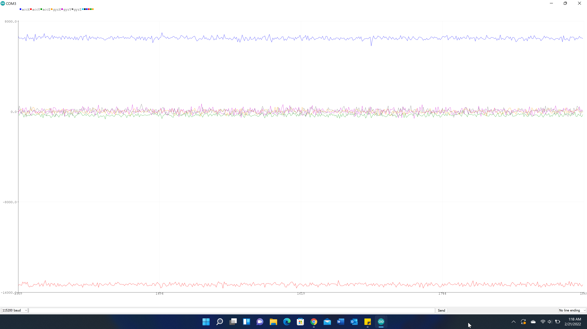

**Date: February 9nd, 2022**

# Objectives
1. Figure out the wiring between the TOF sensors, IMU, and Artemis Nano and solder the connections
2. Get the sensors functioning/Test the sensors

# Components
- 1 x SparkFun RedBoard Artemis Nano
- 1 x USB-C to USB-C cable
- 2 x VL53L1X Time of Flight sensors
- 1 x ICM-20948 Inertial Measurement Unit sensor
- Stranded wires
- Soldering iron + solder

# Procedure
1. Installed the SparkFun VL53L1X Time of Flight Sensor library & the SparkFun 9DOF IMU Breakout ICM 20948 Arduino Library in the Arduino IDE.
2. Thinking about their respective positioning on the fast robot car, I did all the soldering first.

- Using the QWIIC-to-cable connecter to the IMU.
- Then daisy chained the first TOF
- The daisy chained that to the other TOF
    - The second TOF has the XSHUT pit connect to the Artemis nano pin A3.
        

3. Uploaded File->Examples->Apollo3->Example05_Wire_I2C
    - VL53L1X I2C device address: 0x52 = 82 in decimal = 0b1010010 in binary
    - ICM-20948 I2C address: AD0 = 0  0x68 = 104 in decimal = 0b1101000 in binary
        - AD0_VAL is 1 by default unless the ADR jumper is connected. Connecting the I2C ADR jumper changes the default address of the IMU and AD0_VAL becomes 0. In this case the internal jumper is connected, so AD0_VAL should be 0.
        - see properly when just the IMU is connected – before I connected the 2 TOF I actually tested the IMU

{% include youtube.html video="bHrGxIOisgo"}

4. I ran into the issue with printing the addresses when all the sensors are connected.

5. I used .setDistanceModeShort();
    - affected by ambient light less than the other mode.
7. Uploaded File->Examples->SparkFun VL53L1X 4m Laser Distance Sensor->Example1_ReadDistance
    - I changed the sketch to also get the ranging time and the presecribed inter-measurement period
    - Removed the vacuum tape from the sensor
    - Set the tof at the end of the tape measure and moved the black and red box towards and away from the sensor
    - Performed 3 trials

### Range, accuracy, repeatability

- The sensor has good repeatability even in the short distance mode
- The data is very linear between 0.5 feet and 2 feet which means the expected and actual measurements match and are therefore accurate
- The x-offset of the graph shows the minimum discernable distance is around an inch in practice
- I found the maximum distance measured in short distance mode to be 7.71 ft when the actual distance was 8 ft. After going past 8ft, the measured distance registered as 0.00 ft.
### Ranging time
- I used the .getIntermeasurementPeriod() method
  - The specified inter-measurement period (in milliseconds) determines how frequently the sensor takes a measurement
if it is shorter than the timing budget, the sensor will start a new measurement as soon as the previous one finishes
According to the datasheet, the default timing budget is 100 ms
  - It is possible to decrease it to 20 ms only in short distance mode
- Also manually calculated the elapsed time using millis() and taking the difference of the time just after ranging starts and just after ranging stops

{% include youtube.html video="dusu5DqSAVc"}

- As I take measurements as different distances, the calculated time and period are constant
- Increasing the timing budget increases the maximum distance the device can range and improves the repeatability error. However, average power consumption augments accordingly.
- Using my hand and notebook didn’t change the results significantly.

Using notes from the pre-lab, hook up both ToF sensors simultaneously and demonstrate that both works.
HAVEN’T GOTTEN THIS TO WORK YET

8. Uploaded File -> Examples -> SparkFun 9DoF IMU Breakout – ICM 20948 – Arduino Library -> Arduino -> Example1_Basics

- I changed the sketch to only output the data I needed for each test
  - I also did a test on the difference between the raw IMU data vs the scaled IMU data.
### Raw IMU Data

### Scaled IMU Data

- The scaled data looks less noisy

9. Altered the sketch AGAIN -> use imu_test4. Check out the change in sensor values as you rotate, flip, and accelerate the board. Explain what you see in both acceleration and gyroscope data.
video
*** units is milli g ***
10. Accelerometer: Use the equations from class to convert accelerometer data into pitch and roll.
 - Show the output at {-90, 0, 90} degrees pitch and roll. Hint: You can use the surface and edges of your table as guides to ensure 90 degree tilt/roll.
viedo
  - How accurate is your accelerometer? You may want to do a two-point calibration (i.e. measure the output at either end of the range, and calculate the conversion factor such that the final output matches the expected output).

11. Try tapping the sensor and plot the frequency response. What frequency spectrum does the “unwanted noise” have?

12. Use these measurements to guide your choice of a complimentary low pass filter cut off frequency (recall implementation details from the lecture. Discuss how the choice of cut off frequency affects the output.

13. Gyroscope: Use the equations from class to compute pitch, roll, and yaw angles from the gyroscope.
  - Compare your output to the pitch and roll values from the accelerometer and the filtered response. Describe how they differ.
  - Try adjusting the sampling frequency to see how it changes the accuracy of your estimated angles.
  - Use a complimentary filter to compute an estimate of pitch and roll which is both accurate and stable. Demonstrate its working range and accuracy, and that it is not susceptible to drift or quick vibrations.

