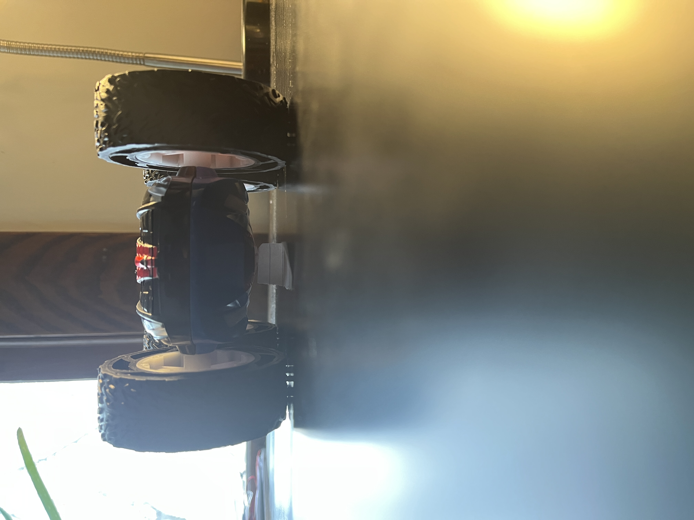
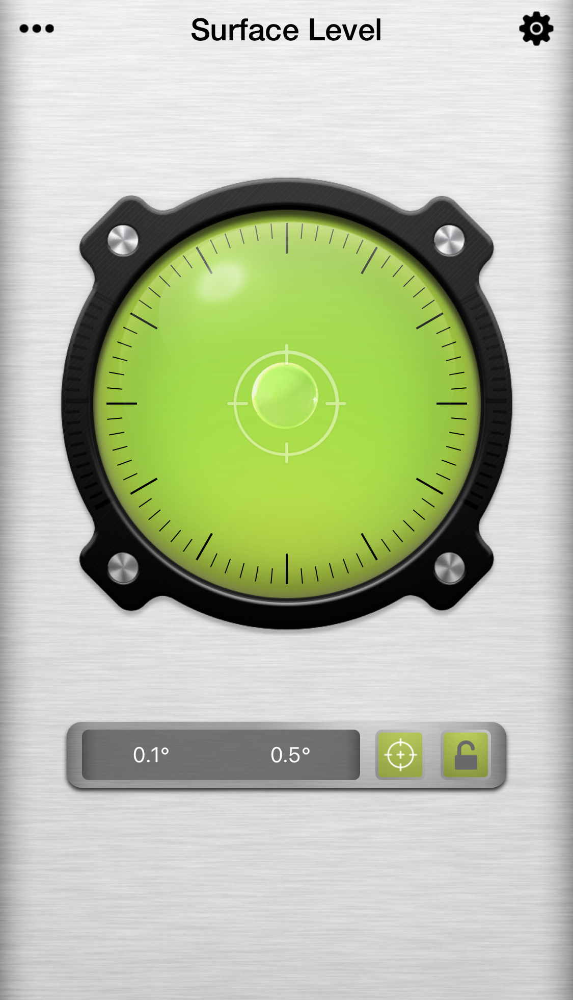
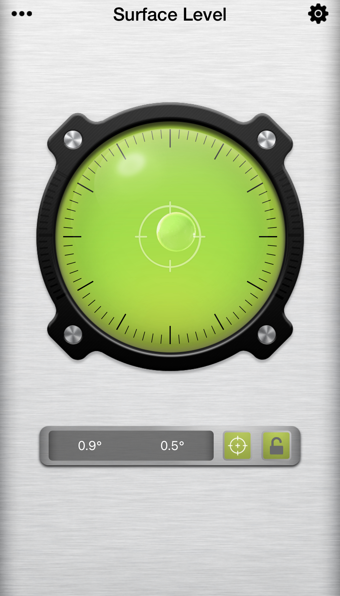
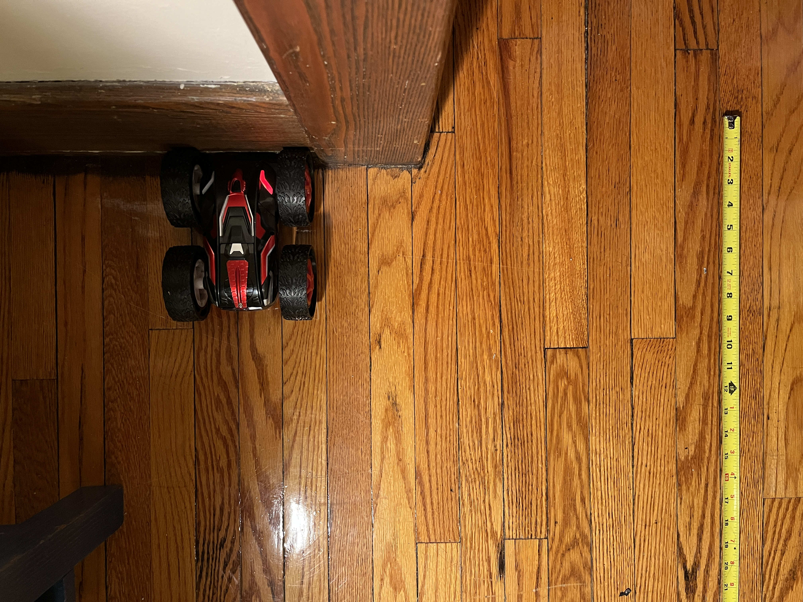
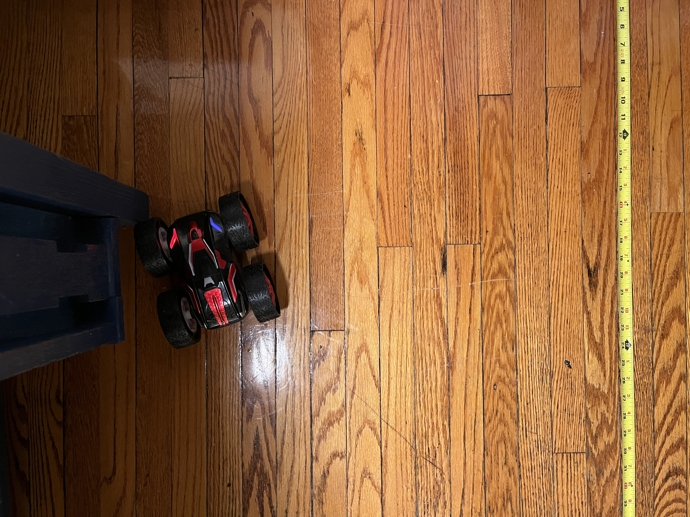

**Date: February 16th, 2022**

# Objectives
1. Learn about the capabilities of the car and measure particular aspects of the car that will be useful in future labs

# Components
- 1 x RC car
- 1 x Manual Remote Controller
- 2 x 3.7V 650mAh Li-Po Rechargeable Batteries

# Procedure
## Test 1
### Dimensions of the RC car
Good for pose data and necessary for control and dynamics

Wheel diameter: 3 1/8” = 7.9375cm (From the outer tread across to the outer tread)

Wheel thickness: 1 1/8” = 2.8575 cm

Body length: 6 3/8” = 16.1925 cm

Body width (@ the center): 3” = 7.62 cm

Wheel separation: 3.5” = 8.89 cm (Distance from inner side of left wheel to inner side of right wheel)

Ground clearance: 9/16” = 1.4288 cm

I used this scrap of paper to find the clearance. I changed the height of the tab and passed it under the car until it brushed the underside. Then I measured the length of the tab.

## Test 2
### Battery Life
The 650mAh Li-Po batteries provide about 8-10 minutes of moving time to the RC car. This is good to know for future operations. No function or action can take more than this amount of time to execute or perform tasks.

~video
When the battery dies, it can no longer power the motors, so the wheels start to shutter and eventually stop moving altogether.

## Test 3
### Charging
The 650mAh Li-Po batteries take about 90 minutes to fully charge after being fully depleted (1-2hours).

## Test 4
### Drift
While attempting to manually drive in a straight line, the RC car tend to drift to the RC car's left. The car was driving on smooth hard wood floors. I checked the levelness of the surface using an app on my iPhone.

Surface Levelness at the starting point

Surface Levelness at the middle point

Surface Levelness at the end point

Overall, my floor is very level, so that will not influence the motion of the RC car.

### Driving Forward Slowly
~video

Driving slow (impluse control inputs by repeatedly pressing the drive forward button) caused a drift of 1 foot and 6 inches (45.72 cm) to the left 10 ft from the RC car's starting point.

This is a still taken from a different angle

~ video
Driving fast (continuously holding down the drive forward button) caused a drift of 1 foot and 8 7/8 inches (53.0225 cm) to the left 9 ft from the RC car's starting point.

This is a still taken from a different angle

