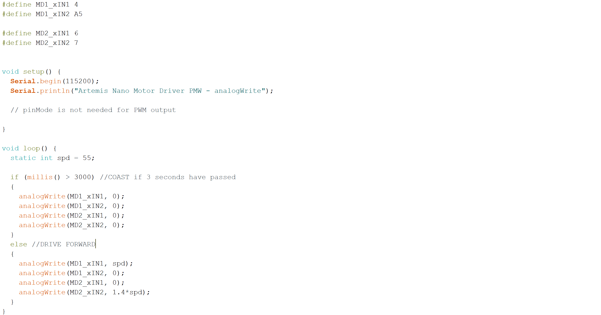

**Date: February 23rd, 2022**

# Objectives
1. Connect both motor drivers to the RC car motors
2. Use the Artemis Nano to control the mtion of the RC car (open loop)

# Components
- 1 x RC car
- 1 x 3.7V 650mAh Li-Po Rechargeable Battery
- 1 x 3.7V Lipo Battery 850mAh Rechargeable Battery
- 2 x DRV8833 Dual H-Bridge Motor Driver 
- 1 x Artemis Nano

# Procedure
### 1.
According to the motor driver datasheet, the power supply voltage can range between 2.7 V and 10.8 V, and the battery we are using for the motor driver operates in that range (850mAh, 3.7V). I hookedup the first motor driver as follows: 

 

I coupled AIN1, BIN1 in parallel and AIN2, BIN2 in parallel. To do this, I put the signal wire from the Artemis Nano through the first pin and soldered it in place. Then I bent the wire and looped it through the other pin and soldered in in place. Because the area is so small, I covered the wiring with hot glue to prevent contact between xIN1 and xIN2. I did the same thing for the respective outputs as well.

 

### 2.
I attached the first motor driver to pins 4 and A5 on the Artemis, becuase they are both PWM capable. The second motor driver will utilize pins A6 and A7 on the Artemis, becuase they are also PWM capable. These 4 pins are all next to each other on the Artemis board. Next, I wrote code to control the PWM for the motor driver. This code increases the PWM value from 0 to 255 and then decreases from 255 to 0 and repeats:

First, I checked that the Artemis Nano was outputing a PWM signal. I connected the oscilloscope probe to the motor driver input 1 (the green wire). At this point, since I had not yet wired in the second motor driver, I used a breadboard to make it easy to ensure all components had a common ground. Using some additional wires, I grounded the motor driver, the Artemis Nano, and the oscilloscope probe. This is the first setup:

 

This is the output from the first setup:



Once I saw the proper signal, I added a second channel to the oscilloscope. I connected the probe to the input's respective output (the light blue wire) and grounded it on the breadboard as well. This is the second setup:

This is the output from the second setup: 



### 3.
I took apart the RC car

I soldered the two outputs of the first motor driver to the leads of one of the car motors.

### 4.
I controlled the direction of the motor rotation based on this logic:

I set `analogWrite(MD1_xIN1, 45);` and `analogWrite(MD1_xIN2, 0);`, then `analogWrite(MD1_xIN1, 0);` and `analogWrite(MD1_xIN2, 45);` to go in the opposite direction. I settled on this value after some testing. At 15 the wheels didn't move at all, and there was a buzzing noise. At 25 there was some twitching, and there was still buzzing. At 35 the wheels would spin if I gave them an initial push, and there was still some buzzing. At 45, the wheels spun on their own. I found that at 80, the wheels moved super fast, and that was not necessary for this task.





### 5.
I carefully matched the positive and negatice terminals of the 650mAh battery and the JST connector, added heat shrink to each branch, and soldered the matching wires. I used a permanent connection in this case, becuase the Artemis shouldn't draw too much power and can recharge the battery while plugged into a USB. The orange light indicates the battery is charging.

This is the car running only on power from the batteries:



### 6.
I went through the same process for the second motor driver. I connected one GND pin to the first motor driver and the other GND pin to the Artemis Nano. Now both the motor drivers and Artemis have a common ground. The input pins of the second motor driver are connected to pin 6 and 7 on the Artemis which are both PWM capable. V_IN is daisy chained from the first motor driver which is powered by the 850mAh, 3.7V battery. This is the output PWM and the motor driver output:



To show this second motor driver can spin its wheels in both directions I had them go clockwise for 3 seconds then switch to counterclockwise for 3 second and repeat: 



### 7.
I secured all the components in the car and uploaded code to drive forward for 3 seconds. This code segment includes the calibration factor I determined later on, but originally I ran both motors with the same input:

I placed the car at the end of an 8ft long tape measure and ran the code.



As I found in Lab 4 as well, the car tends to drift to the left without any corrective action implemented.

### 8. 
The lower limit of PWM signal that would still propel the car was affected by the battery voltage. In my experimentation, I started by incrementing the PWM signal by 10. I found that 10, 20, and 30 did not get the car to move. However, 40 worked and the car moved on the ground. Then I refined my step. 35 didn't work, 36 didn't work, but 37 had a little movement. So, 37 is the bare minimum to get any movement at all (with not-fully-charged 850mAh, 3.7V battery).

### 9.
Motor speed has a nonlinear response and depends on several factors. Calibration will depend on PWM signal/motor speed and the battery voltage. I saw that the left side was lagging compared to the right side, and at a PWM of 55, I found success at moving in a straight line by multiplying the left side speed by a factor of 1.4.



### 10.
My plan for the open loop control was to drive straight, turn right, drive straight, turn left, and then reverse. I noticed that the turns wouldn't execute if run at the same speed as the forward/reverse movements. I doubled the speed of the motors compared to the foward/reverse speed. I used `delay()` to time the actions.


