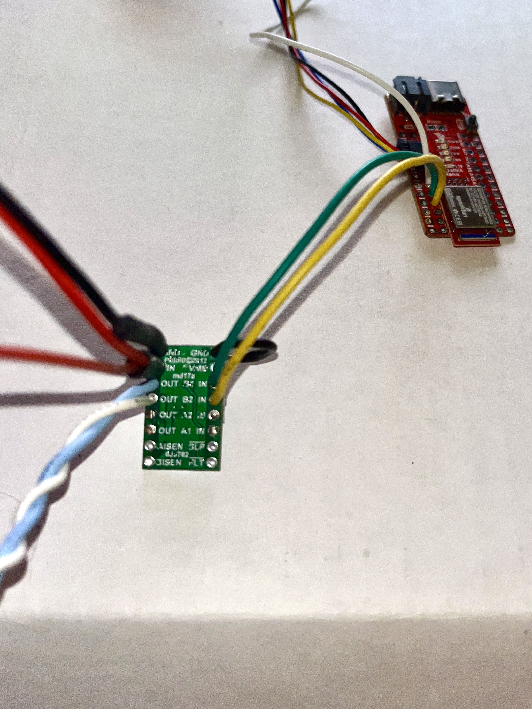
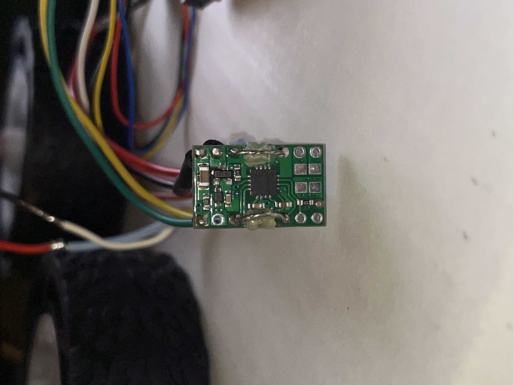
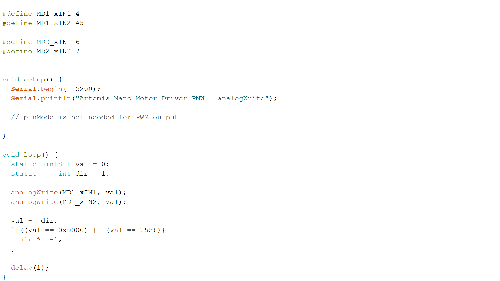
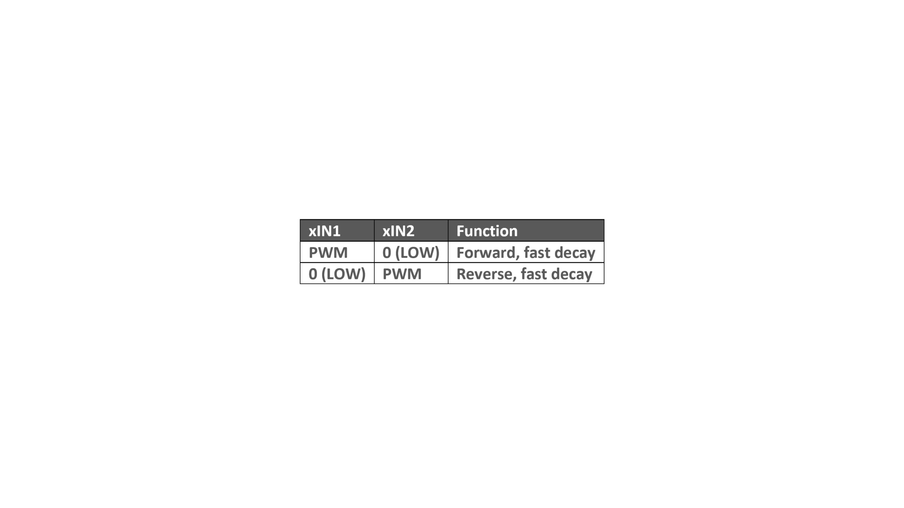

**Date: February 23rd, 2022**

# Objectives
1. Connect both motor drivers to the RC car motors
2. Use the Artemis Nano to control the mtion of the RC car (open loop)

# Components
- 1 x RC car
- 1 x 3.7V 650mAh Li-Po Rechargeable Battery
- 1 x 3.7V Lipo Battery 850mAh Rechargeable Battery
- 2 x DRV8833 Dual H-Bridge Motor Driver 
- 1 x Artemis Nano

# Procedure
### 1.
According to the motor driver datasheet, the power supply voltage can range between 2.7 V and 10.8 V, and the battery we are using for the motor driver operates in that range (850mAh,3.7 V). I hookedup the first motor driver as follows: 

 

I coupled AIN1 and BIN1 in parallel and AIN2 and BIN2 in parallel. I did the same thing for the respective outputs as well. I put the signal wire through the first pin and soldered it in place. Then I bent the wire and looped it through the other pin and soldered in in place to the put the two pins in parallel. Because the area is so small, I covered the wiring with hot glue to prevent contact. 

 

### 2.
I attached the first motor driver to pins 4 and A5 on the Artemis, becuase they are both PWM capable. I will attach the second motor driver to pins A6 and A7 on the Artemis, becuase they are also PWM capable. These 4 pins are all next to each other on the board. Next, I wrote code to control the PWM for the motor driver:

First, I checked that the Artemis Nano was actually outputing a PWM signal. I connected the oscilloscope probe to the motor driver input 1 (the green wire). At this point, since I had not yet wired in the second motor driver, I used a breadboard to make it easy to ensure all components were grounded together. Using some additional wires, I grounded the motor driver, the Artemis Nano, and the oscilloscope probe. This is the setup:

 

This is the output from the Artemis Nano:



Once I saw that, I added a second channel to the oscilloscope. I connected the probe to respectively output (the light blue wire) and grounded it on the breadboard as well. This is the second setup:

With this setup, the output was this: 



### 3.
I took apart the RC car

I soldered the two outputs of the motor driver to the leads of one of the car motors.

### 4.
I controlled the motor based on this logic:

I set `analogWrite(MD1_xIN1, 45);` and `analogWrite(MD1_xIN2, 0);`, then `analogWrite(MD1_xIN1, 0);` and `analogWrite(MD1_xIN2, 45);` to go in the opposite direction. I found that at 80, the wheels moved super fast (almost concerningly in this situation). At 15 the wheels didn't move at all, and there was a buzzing noise. At 25 there was some twitching, and there was still buzzing. At 35 the wheels would spin if I gave them an initial push, and there was still some buzzing. At 45, the wheels spun on their own.





### 5.
I carefully mateched the positive and negatice terminals of the 650mAh battery and the JST connector, soldered, and added heat shrink for each branch. I used a permanent connection in this case, becuase the Artemis shouldn't draw too much power and can recharge the battery while plugged into a USB 

This is the car running only on power from the batteries:



### 6.
I did the same thing for the second motor driver. I connected on GND pin the first motor driver and the other GND pin to the Artemis Nano. The input pins are connected to pin 6 and 7 on the Artemis which are both PWM capable. V_IN is daisy chained from the first motor driver which is powered by the 850mAh, 3.7V battery. This is the output PWM and the motor driver output:



To show this side can spin its wheels in both directions I had them go clockwise for 3 seconds then switch to counterclockwise for 3 second and repeat that: 



### 7.
I secured all the components in the car and uploaded code to drive forward for 3 seconds:

IMG

I set the car at the end of an 8 ft long tape measure and ran the code.

VIDEO

### 8. 

### 9.
Motor speed has a nonlinear response. Calibration will depend on PWM signal/motor speed and the battery voltage. I saw that the left side was lagging compared to the right side. At a PWM of 55, I found success by multiplying the left side speed by a factor of 1.4.

VID

### 10.
My plan for the open loop control was to drive straight, turn right, drive straight, turn left, and then reverse. I noticed that the turns wouldn't execute if run at the same speed as the forward/reverse movements. I doubled the speed of the motors compared to the foward/reverse speed. I used `delay()` to time the actions.

IMG

VID
