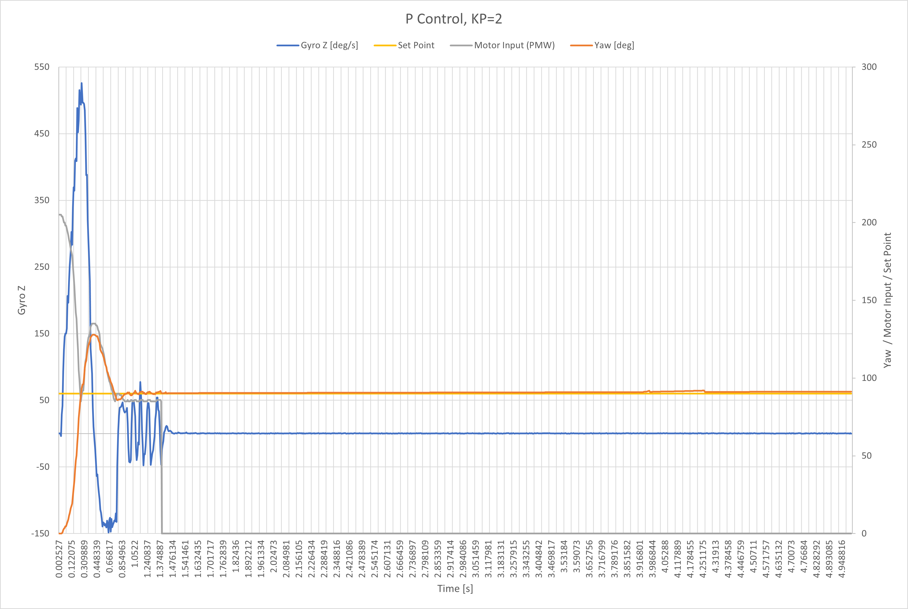

**Date: March 2022**

In this lab I will go through the steps to implement PID control in the car.

### Maximum Angular Speed
video


I tested the car's max angular speed by ramping up then down the PWM value while driving one side of the wheels foward and the other side in reverse. Initially the max degrees per second (dps) was set to 1000 thinkkng that would be high enough to capture the data. In the first test you can see the saturation of the sensor at 1000. I increased the max dps to 2000 which is the maximum detectable angular rate of this sensor. I performed 3 tests and found the maximum to be just under 1200 dps.


 

### Data Collection Frequency
To speed up the execution of my loop, I decided to run the control tasks and record all the data, and then after that was all completed, I sent all the data via Bluetooth. The frequency also depends on how many variables are being kept. In the max angular speed tests, the frequency of loop execution was 0.13 seconds. During orientation control with full PID control the frequency was 0.01 seconds. I had refined the process by this stage.

### Deadband
When purely rotating about the axis when initially at rest, the car wouldn’t start until the PWM was 102, but when ramping down, the car stopped spinning when the PWM dropped to 68. The deadband for linear motion was a little harder to pin down with a base speed was introduced when doing the actual task. The PWM need to be at least around 50 for the car to start moving forward in a stright line. 

### Integrator Wind up
I wrote a scaling function such that the PWM passed to the motor drivers never exceed 255 and PWM is in a range between 85 and 255. I got the value 85 by taking the midpoint value of 102 and 68. 

```
uint8_t scalingFunc(double input)
{
  double output = 85 + (0.667 * abs(input));
  if (output > 255) {
    output = 255;
  }
  return (uint8_t) output;
}
```

### Low Pass Filter
I implemented the digital low pass filter on the gyroscope. I noticed improvements in the drift and noise of the gyroscope sensor after enabling the LPF.
```
  // Set up Digital Low-Pass Filter configuration
  ICM_20948_dlpcfg_t myDLPcfg;
  myDLPcfg.a = acc_d473bw_n499bw;
  myDLPcfg.g = gyr_d361bw4_n376bw5;
  myICM.setDLPFcfg((ICM_20948_Internal_Acc | ICM_20948_Internal_Gyr), myDLPcfg);
  if (myICM.status != ICM_20948_Stat_Ok)
  {
    Serial.print(F("setDLPcfg returned: "));
    Serial.println(myICM.statusString());
  }

  // Choose whether or not to use DLPF
  ICM_20948_Status_e accDLPEnableStat = myICM.enableDLPF(ICM_20948_Internal_Acc, false);
  ICM_20948_Status_e gyrDLPEnableStat = myICM.enableDLPF(ICM_20948_Internal_Gyr, true);
```
### Derivative Kick
After implementing D control, I didn’t really notice any significant effects in the physical system when changing the set point. However, when I plotted the controller u, I did see a spike, the derivative kick, when the set point changed. I decided to implement “derivative on measurement” which might be more useful in other applications. The difference is evident in the following graphs. The axes for both graphs are the same, so the visual comparison is easy. There is no sharp peak/jump when derivative on measurement is implemented.


### Tuning the PID controller
I first began by tuning my PID controller for orientation control on yaw which is measured in degrees. Graphs after many, many attempts. I will spare you all the funky graphs. 

I used a more intuitive way to tune my controller. I’ve learned about PID control in previous control theory classes (System Dynamics), so I was familiar with the effects of changing the PID gain. In general, increasing the proportional control decreases rise time and steady state error, but increases overshoot. Increasing derivative control decreases the overshoot but also decreases the settling time. Increasing the integral control decreases the rise time and steady state error, but also increases the overshoot and settling time.

The sequence of plots mirrors my thought process behind tuning the controller.





I found K_P = 3, K_D = 0.3, and K_I = 0.3 made a good controller for my system. The result is following motion.





I created new switch cases for the command types for the different tasks I performed throughout the lab. This made passing the proportional, integral, and derivative gains or any other information needed to the car/Artemis program easy.

I incorporated a tolerance such that if the measured yaw is within a quarter of a degree (or whatever tolerance I want to set) the car will stop moving as it is at the desired yaw using this code: `abs(error) < 0.25`

### No Drift
I tested my controller by using PID to drive in a straight line by setting the set point to zero degrees.

 



The hard active brake at the end causes the car to twist at the end of the video. Since this happens after executing and exiting the control loop, the change in yaw is not reflected in the data plotted.

### Drift
Then I performed the drift! This is when I realized I needed to deal with derivative kick.

The turn when I changed the set point wasn’t working super efficiently. The radius of curvature was really big, so I changed how I handled the motor offset. The same PID gains worked well for this change. 





