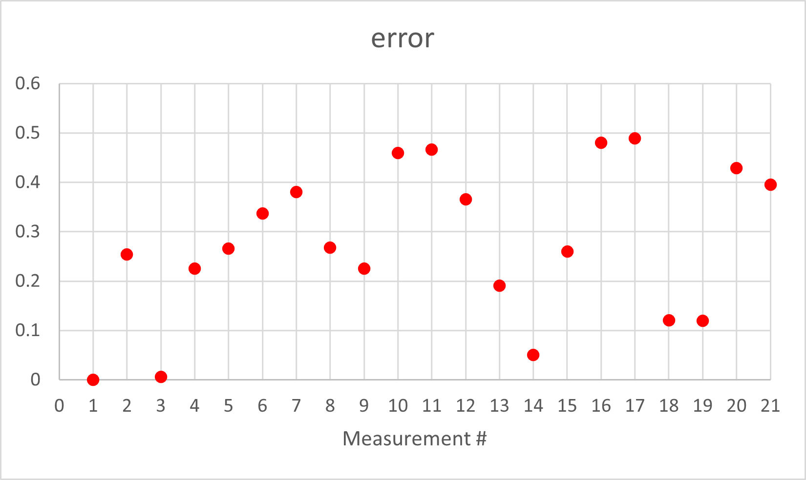

**Date: April 2022**

### Orientation control
I chose to do PID control on the yaw data from the gyroscope (my z axis) to control to robot's orientation. I rotated in 18 degree increments to get an even 20 measurements. I actually got 21 data points because I collected for both 0 degrees and 360 degrees. I passed a PWM value of 130 to the motor drivers. In lab 6 I determined the deadband for spinning from rest about the robot's axis was below a PWM value of 102, but I wasn't able to get the robot to turn reliably at values less than 130.

The calculated yaw from the gyroscope data was very close to the given set points.




I didn't get a video in the lab, but I did do a test at home. It worked just as well at home as it did in the lab.
upload a video that shows if your robot turns (roughly) on axis.

I set a tolerance such that when the error was less than half a degree the robot would stop and get distance data. Therefore, the angle error was less than 0.5 degrees. The axis of rotation might move 2.5cm to 5cm. So for a single distance measurement, error = 5cm * cos(0.5 deg) which is essentially 5cm.

### Read Out Distances
Consider whether your robot behavior is reliable enough to assume that the readings are spaced equally in angular space, or if you are better off trusting the orientation from integrated gyroscope values.
As I watched the robot during data collection, the orientation changes looked equally space, and this was based off the orientation from integrated gyroscope values. My robot spun pretty quickly then braked once the yaw value was close enought to the set point. I this helped keep the accumulated error relatively low becuase the robot executed its task over a short amount of time. However, later on I realized there was error that affect my data.

The polar graphs do match up with the expected map, but it seems there is a slight angular offset.

### (0,3)


### (5,3)


### (-3,-2)


### (5,-3)


### (0,0)


### Merge and Plot your readings
After collecting my data and sending it to my computer via Bluetooth, I exported the data to a csv file and loaded it into MATLAB where I did all of my computation.

I converted the ToF measurements to feet and then converted the Tof measurements and yaw data from polar coordinate to Cartesian coordinates.
```
x = dist.*cos(theta);
y = dist.*sin(theta);
```

I wrote a function that transforms an (x, y) point in the robot frame to a point in the global frame given the robot's pose (x, y, theta) and the (x, y) to be transformed. For each data collection, the robot's orientation in the global frame was 180 degrees (pi (rad)). I also took into consideration that the ToF sensor was offset from the axis of rotation.

```
sensorOrigin = [0.229 ft, 0]; % robot frame
```

```
% rotation matrix
R_IB = [cos(pose(3)) -sin(pose(3)); sin(pose(3)) cos(pose(3))];

% translation from global frame origin to robot frame origin
d = [pose(1); pose(2)];

% transformation matrix
T_IB = [R_IB d; 0 0 1];

xy = T_IB*[xyR'; 1]; % transform to global frame

xyG = [xy(1) xy(2)]; % global (x,y) coord
```
This is were I really noticed the effects of some angular offest.


I found it easier to interpret the data by representing it with points instead of connecting lines.


To correct for the angular offset I subtracted 20 degrees from the orientation of the robot.


### Convert to Line-Based Map


Improved to:


I think the map looks pretty good!

```
Start:
[-5,6.5],
[6.5,6.5],
[6.5,-2.25],
[-2.25,-2.25],
[-2.25,-5],
[-5,-5],
[4.85, 4.85],
[2.5, 4.85],
[2.5, 2.5],
[4.85, 2.5]


End:
[-4.25,-4.25],
[-4.25,4.5],
[4.5,4.5],
[4.5,0.6],
[0.6,0.6],
[-4.25,0.6],
[1.7,-0.7],
[-0.7,-0.7],
[-0.7,1.7],
[1.7,1.7]
```

