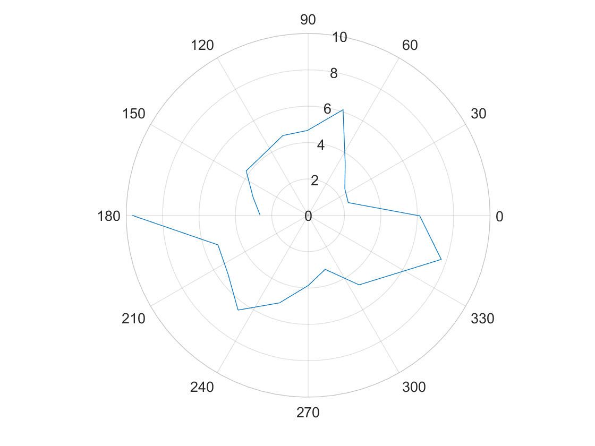
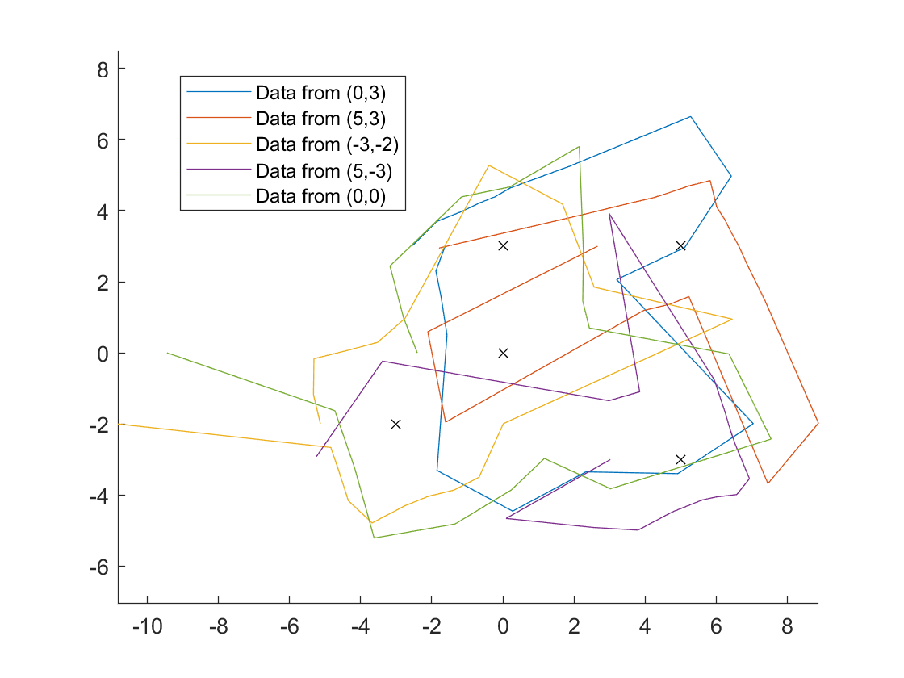

**Date: April 2022**

### Orientation control
I chose to do PID control on the yaw data from the gyroscope (my z axis) to control to robot's orientation. I rotated in 18 degree increments to get an even 20 measurements. I actually got 21 data points because I collected for both 0 degrees and 360 degrees. I passed a PWM value of 130 to the motor drivers for turning. In lab 6 I determined the deadband for spinning from rest about the robot's axis was below a PWM value of 102, but I wasn't able to get the robot to turn reliably at values less than 130.


upload a video that shows if your robot turns (roughly) on axis.

Given the drift in your sensor, the size and accuracy of your increments, and how reliably your robot turns on axis, reason about the average and maximum error of your map if you were to do an on-axis turn in the middle of a 4x4m square, empty room.

### Read Out Distances
Consider whether your robot behavior is reliable enough to assume that the readings are spaced equally in angular space, or if you are better off trusting the orientation from integrated gyroscope values.

Sanity check individual turns by plotting them in polar coordinate plot. For simplicity assume that the robot is rotating in place. Do the measurements match up with what you expect?

### (0,3)


### (5,3)


### (-3,-2)


### (5,-3)


### (0,0)


### Merge and Plot your readings
Compute the transformation matrices and convert the measurements from the distance sensor to the inertial reference frame of the room (these will depend on how you mounted your sensors on the robot.)
Describe the matrices
Plot all of your TOF sensor readings in a single plot. Please assign different colors to data sets acquired from each turn.



### Convert to Line-Based Map
To convert this into a format we can use in the simulator, manually estimate where the actual walls/obstacles are based on your scatter plot. Draw lines on top of these, and save two lists containing the end points of these lines: (x_start, y_start) and (x_end, y_end). In the next lab, we will import these lists into the simulator.

Feel free to correct slight errors found discovered during post processing in this step, but be sure to explain what caused them and how/why you correct them.


Improve to:


```
Start:
[-5,6.5],
[6.5,6.5],
[6.5,-2.25],
[-2.25,-2.25],
[-2.25,-5],
[-5,-5],
[4.85, 4.85],
[2.5, 4.85],
[2.5, 2.5],
[4.85, 2.5]


End:
[-4.25,-4.25],
[-4.25,4.5],
[4.5,4.5],
[4.5,0.6],
[0.6,0.6],
[-4.25,0.6],
[1.7,-0.7],
[-0.7,-0.7],
[-0.7,1.7],
[1.7,1.7]
```

