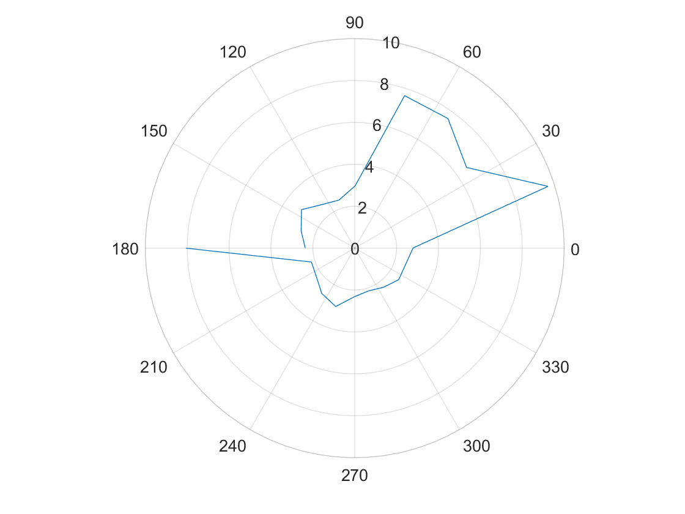
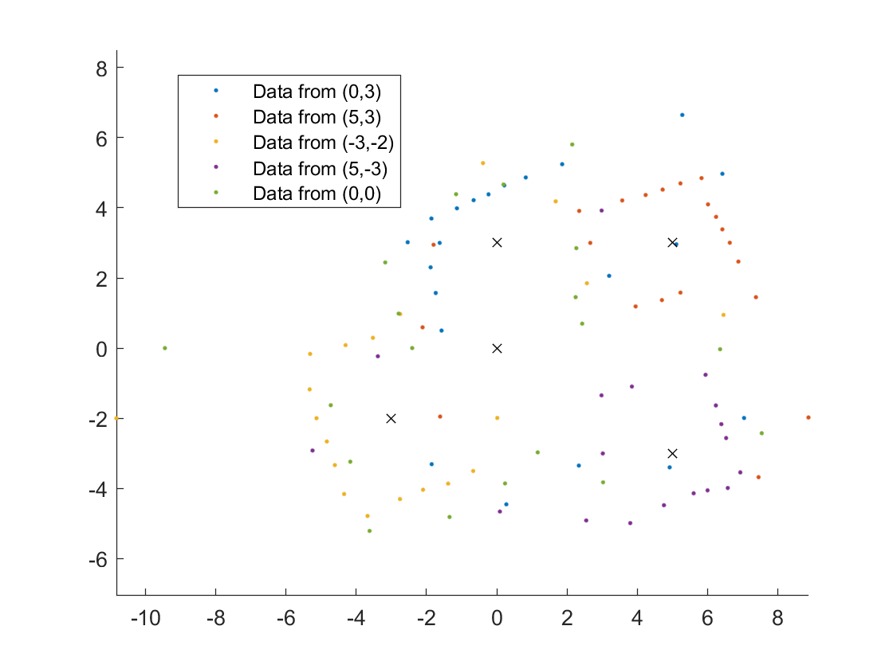

**Date: April 2022**

### Orientation control
I chose to do PID control on the yaw data from the gyroscope (my z axis) to control to robot's orientation. I rotated in 18 degree increments to get an even 20 measurements. I actually got 21 data points because I collected for both 0 degrees and 360 degrees. I passed a PWM value of 130 to the motor drivers for turning. In lab 6 I determined the deadband for spinning from rest about the robot's axis was below a PWM value of 102, but I wasn't able to get the robot to turn reliably at values less than 130.

The yaw calculated from the gyroscope was very close to 


upload a video that shows if your robot turns (roughly) on axis.

Given the drift in your sensor, the size and accuracy of your increments, and how reliably your robot turns on axis, reason about the average and maximum error of your map if you were to do an on-axis turn in the middle of a 4x4m square, empty room.

### Read Out Distances
Consider whether your robot behavior is reliable enough to assume that the readings are spaced equally in angular space, or if you are better off trusting the orientation from integrated gyroscope values.
As I watched the robot during data collection, the orientation changes looked equally space, and this was based off the orientation from integrated gyroscope values. My robot spun pretty quickly then braked once the yaw value was close enought to the set point. I this helped keep the accumulated error relatively low becuase the robot executed its task over a short amount of time. However, later on I realized there was error that affect my data.

The polar graphs do match up with the expected map, but it seems there is a slight angular offset.

### (0,3)


### (5,3)


### (-3,-2)


### (5,-3)


### (0,0)


### Merge and Plot your readings
After collecting my data and sending it to my computer via Bluetooth, I exported the data to a csv file and loaded it into MATLAB where I did all of my computation.

I converted the ToF measurements to feet and then converted the Tof measurements and yaw data from polar coordinate to Cartesian coordinates.
```
x = dist.*cos(theta);
y = dist.*sin(theta);
```

I wrote a function that transforms an (x, y) point in the robot frame to a point in the global frame given the robot's pose (x, y, theta) and the (x, y) to be transformed. For each data collection, the robot's orientation in the global frame was 180 degrees (pi (rad)). I also took into consideration that the ToF sensor was offset from the axis of rotation.

```
sensorOrigin = [0.229 ft, 0]; % robot frame
```

```
% rotation matrix
R_IB = [cos(pose(3)) -sin(pose(3)); sin(pose(3)) cos(pose(3))];

% translation from global frame origin to robot frame origin
d = [pose(1); pose(2)];

% transformation matrix
T_IB = [R_IB d; 0 0 1];

xy = T_IB*[xyR'; 1]; % transform to global frame

xyG = [xy(1) xy(2)]; % global (x,y) coord
```
This is were I really noticed the effects of some angular offest.


I found it easier to interpret the data by representing it with points instead of connecting lines.


To correct for the angular offset I subtracted 20 degrees from the orientation of the robot.


### Convert to Line-Based Map
Feel free to correct slight errors found discovered during post processing in this step, but be sure to explain what caused them and how/why you correct them.


Improve to:


```
Start:
[-5,6.5],
[6.5,6.5],
[6.5,-2.25],
[-2.25,-2.25],
[-2.25,-5],
[-5,-5],
[4.85, 4.85],
[2.5, 4.85],
[2.5, 2.5],
[4.85, 2.5]


End:
[-4.25,-4.25],
[-4.25,4.5],
[4.5,4.5],
[4.5,0.6],
[0.6,0.6],
[-4.25,0.6],
[1.7,-0.7],
[-0.7,-0.7],
[-0.7,1.7],
[1.7,1.7]
```

